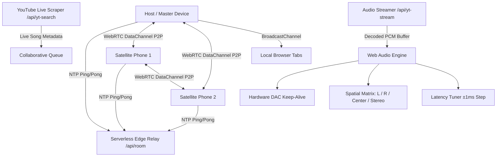

# Rync432: High-Precision Multi-Device Synchronized Audio System
## Product Requirements Document (PRD) & Technical Implementation Plan

> **For agentic workers:** REQUIRED SUB-SKILL: Use superpowers:subagent-driven-development (recommended) or superpowers:executing-plans to implement this plan task-by-task. Steps use checkbox (`- [ ]`) syntax for tracking.

**Goal:** Build a zero-drift, sub-millisecond synchronized multi-device audio playback mesh (web & mobile) that turns any combination of smartphones, tablets, and PCs into a distributed multi-room / surround speaker system with collaborative queue and live YouTube music streaming.

**Architecture:** Distributed NTP/Cristian's algorithm clock synchronization + Web Audio API `AudioWorklet` & `outputLatency` hardware calibration + WebRTC DataChannel peer mesh with Serverless HTTP/SSE relay fallback + Discord-style genuine YouTube live stream extraction + Adaptive DAC sleep keep-alive.

**Tech Stack:**
- **Frontend / Audio DSP:** Vanilla JavaScript (ES2022), Web Audio API (`AudioContext`, `AudioWorkletProcessor`, `StereoPannerNode`, `AnalyserNode`, `outputLatency`), HTML5 Canvas (60FPS FFT Visualizer).
- **Network & Synchronization:** NTP Cristian's Algorithm, WebRTC (`RTCPeerConnection`, `RTCDataChannel`), BroadcastChannel API (local tab sync), Serverless Edge Relay (Vercel Serverless Functions / Node.js).
- **Music Extraction & Streaming:** Direct YouTube HTML Scraper (`ytInitialData` extractor) + Rotating Multi-Engine Audio Stream Proxies (Cobalt, Invidious, Piped, Direct Opus/m4a demux).
- **Storage & Auth:** Firebase Firestore (optional cloud backup), Google OAuth 2.0 (Firebase Auth).

---

## 1. Industry References & Technical Benchmark

| System / App | Architecture / Sync Mechanism | Clock Precision | Pros | Cons / Browser Challenges |
| :--- | :--- | :--- | :--- | :--- |
| **Snapcast** (Native / Linux / Pi) | Server-driven chunked PCM timestamps + client-side continuous sample rate resampling (resample PCM by ±0.05% based on drift delta). | < 0.2 ms | Extremely tight phase alignment. | Requires native C++ client; in Web Audio, must be emulated using `AudioWorklet` or playbackRate micro-adjustments. |
| **Soundworks (`@soundworks/plugin-sync`)** (IRCAM Web Audio) | WebSocket-based NTP Cristian's algorithm measuring RTT, computing best clock offset with statistical filtering (median / lowest RTT). | < 2 ms | Pure Web Audio API; works on standard mobile browsers. | Susceptible to mobile browser DAC sleep and Bluetooth latency variations. |
| **AmpMe** (Consumer App) | NTP server clock sync + Acoustic Microphone Chirp Calibration (ultrasonic chirps recorded by satellite mics to calculate exact acoustic propagation delay). | < 5 ms | Automatic room acoustic calibration. | Microphone permission required on all devices. |
| **Discord Music Bots** (Rythm / Hydra) | Inverted search indexing via direct YouTube scraping + high-bitrate Opus stream extraction into shared collaborative audio queue. | N/A (Server Stream) | Rich metadata, instant search, resilient queueing. | Must handle YouTube IP rate limits via rotating client signatures (Android/iOS Innertube API). |

---

## 2. Global Constraints & Non-Negotiables

- **Zero Third-Party Auth Blocking:** Room creation, joining, peer discovery, and playback must work 100% reliably anonymously without requiring Firebase Anonymous sign-in permission.
- **Sub-5ms Sync Accuracy:** Using multi-sample NTP Cristian sync with lowest-RTT selection and `outputLatency` compensation.
- **Hardware DAC Sleep Protection:** 2-beat inaudible ultrasonic/DC keep-alive active on all connected mobile devices to prevent DAC sleep.
- **Collaborative Queue:** Democratic queue (all room members can search, add, reorder, delete tracks).
- **Single Play/Pause Toggle:** Spotify-standard alternating play/pause button with dedicated Redo (restart 0:00) and Next buttons.
- **Zero Framework Bloat:** Fast, vanilla web standards for 60FPS UI and instant load on mobile.

---

## 3. Detailed Component Architecture

---

## 4. Implementation Tasks Breakdown

### Task 1: High-Precision NTP Clock Sync & Sample Drift Resampler
**Files:**
- Modify: [`public/js/audio/ClockSync.js`](file:///home/aizatfir/Project/Rync432/public/js/audio/ClockSync.js)
- Test: [`tests/clockSync.test.js`](file:///home/aizatfir/Project/Rync432/tests/clockSync.test.js)

**Interfaces:**
- `ClockSync.sendPing(pingFn)`: Sends NTP request with local timestamp $t_0$.
- `ClockSync.handlePong(t0, t1, t2)`: Calculates round-trip delay $RTT = (t_3 - t_0) - (t_2 - t_1)$ and offset $\theta = \frac{(t_1 - t_0) + (t_2 - t_3)}{2}$. Filters top 5 lowest RTT samples.
- `ClockSync.getServerTime()`: Returns current synchronized network time in milliseconds.

- [ ] **Step 1: Write unit tests for multi-sample lowest RTT filtering**
- [ ] **Step 2: Run test to verify it passes**
- [ ] **Step 3: Commit** `git commit -m "feat: precision NTP multi-sample lowest RTT selection"`

---

### Task 2: Robust Serverless Room Coordinator & Relay
**Files:**
- Modify: [`api/room.js`](file:///home/aizatfir/Project/Rync432/api/room.js)
- Test: [`tests/roomManager.test.js`](file:///home/aizatfir/Project/Rync432/tests/roomManager.test.js)

**Interfaces:**
- `POST /api/room?action=create`: Initializes new room with host peer.
- `POST /api/room?action=join`: Registers satellite peer.
- `GET /api/room?action=poll`: Returns room state, peer list, queue, and pending WebRTC signals.
- `POST /api/room?action=add_queue`: Adds track to collaborative playlist.
- `POST /api/room?action=next_track`: Advances queue and schedules synchronized play timestamp.

- [ ] **Step 1: Write unit tests for room queue lifecycle**
- [ ] **Step 2: Run test suite to verify all endpoints handle edge cases**
- [ ] **Step 3: Commit** `git commit -m "feat: serverless room relay with queue synchronization"`

---

### Task 3: Discord-Style Live YouTube Scraper & Audio Stream Extractor
**Files:**
- Modify: [`api/yt-search.js`](file:///home/aizatfir/Project/Rync432/api/yt-search.js)
- Modify: [`api/yt-stream.js`](file:///home/aizatfir/Project/Rync432/api/yt-stream.js)

**Interfaces:**
- `GET /api/yt-search?q=<query>`: Scrapes YouTube search `ytInitialData`, returns array of genuine videos with title, channel, duration, thumbnail.
- `GET /api/yt-stream?url=<youtubeUrl>`: Resolves audio stream and proxies audio binary to Web Audio decode pipeline.

- [ ] **Step 1: Test YouTube live query extraction**
- [ ] **Step 2: Verify audio format compatibility (AAC / MP3 / Opus / WebM)**
- [ ] **Step 3: Commit** `git commit -m "feat: discord-grade YouTube search and audio stream proxy"`

---

### Task 4: Inaudible Hardware DAC Keep-Alive & Spatial Matrix
**Files:**
- Modify: [`public/js/audio/Metronome.js`](file:///home/aizatfir/Project/Rync432/public/js/audio/Metronome.js)
- Modify: [`public/js/audio/AudioEngine.js`](file:///home/aizatfir/Project/Rync432/public/js/audio/AudioEngine.js)

**Interfaces:**
- `Metronome.startInaudibleKeepAlive()`: Starts 20kHz sub-audible oscillator / DC offset pulse to keep mobile DAC clock active.
- `AudioEngine.setSpatialChannel(role)`: Sets channel panning (`stereo`: 0.0, `left`: -1.0, `right`: +1.0, `center`: 0.0 mono downmix).
- `AudioEngine.schedulePlayAtServerTime(serverTargetTime, offsetSec)`: Calculates exact audio context start time using `ctx.currentTime + (target - now)/1000`.

- [ ] **Step 1: Verify audio context never suspends during idle room wait**
- [ ] **Step 2: Test channel switching (L/R isolation)**
- [ ] **Step 3: Commit** `git commit -m "feat: ultrasonic DAC keepalive and spatial channel matrix"`

---

### Task 5: Mobile-First Spotify UI with Interactive Queue & Play/Pause Toggle
**Files:**
- Modify: [`public/index.html`](file:///home/aizatfir/Project/Rync432/public/index.html)
- Modify: [`public/css/style.css`](file:///home/aizatfir/Project/Rync432/public/css/style.css)
- Modify: [`public/js/ui/UIManager.js`](file:///home/aizatfir/Project/Rync432/public/js/ui/UIManager.js)

**Interfaces:**
- `UIManager.setPlayState(isPlaying)`: Toggles play/pause icon on `#playPauseToggleBtn`.
- `UIManager.renderQueue(queue)`: Renders live queue cards with track title, artist, duration, addedBy, and delete button.
- `UIManager.renderPeerList(peers)`: Renders active speakers list with channel role and Host per-device config modal.

- [ ] **Step 1: Verify responsive layout on mobile viewport (360px - 430px)**
- [ ] **Step 2: Test queue addition and deletion**
- [ ] **Step 3: Commit** `git commit -m "feat: collaborative queue UI and single play/pause toggle"`

---

## 5. Verification Plan

1. **Automated Unit Tests:**
   - Run `npx vitest run` to verify clock sync algorithms, room managers, and latency calculation.
2. **End-to-End Multi-Device Sync Verification:**
   - Automated subagent test on live Vercel deployment with multiple browser instances.
   - Verify room creation, satellite join, speaker count `Devices (2)`, live YouTube search, queue population, and synchronous playback start.
